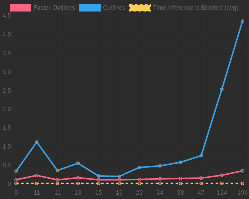

<div align="center" style="margin-bottom: 1em;">
<h1 style="text-align: center;">Faster-Outlines</h1>

</div>

<div align="center">Supercharge your structured text generation with <strong>faster-outlines</strong> - a high-<br>performance Rust backend for the Outlines library.</div>

## Overview

faster_outlines is designed to significantly boost the performance of regex-guided text generation, particularly for LLM inference servers. It's an ideal solution for scenarios where regex patterns for guiding LLM generation are not known in advance.

Key features:
- 🚀 Seamless one-line integration with existing Outlines projects
- 🚀 All the features you already love about outlines 
- ⚡ Asynchronous FSM compilation for immediate start of LLM inference
- 🏎️ Substantial performance improvements, especially for complex regex patterns ( like JSON )
- 🔄 Continuous updates to improve speed!

Upcoming (in no particular order):
- 🍴 vLLM fork using faster_outlines
- 🤝 Official integration with vLLM's main repo (hopefully)
- Redis as a caching backend, for large inference setups
- 🦀 Rust API. ( currently started, but unfinished )

## Why faster_outlines?

1. **Optimized for LLM Inference Servers**: Ideal for scenarios where regex patterns are dynamic and not known beforehand.

2. **Asynchronous Processing**: Unlike the standard Outlines library, faster_outlines allows you to start LLM inference immediately, without waiting for the entire FSM to compile.

3. **Significant Performance Boost**: Especially noticeable with complex regex patterns and large state spaces.

4. **Seamless Integration**: Works with your existing Outlines code with minimal changes (outlines v0.0.46, soon all versions).


## Installation
> [!WARNING]
> faster_outlines currently only supports linux based operating systems.
> You can try compiling on systems such as windows, but your better off using [WSL2](https://learn.microsoft.com/en-us/windows/wsl/install)
> If on a non linux system, you will need to build from source. Make sure you have Rust installed.

```bash
pip install faster_outlines
```

## Quick Start
<details>
<summary>One line patching with outlines (v0.0.46)</summary>
Integrating faster_outlines into your project is as simple as adding one line of code:

```python
import outlines
from faster_outlines import patch

patch(outlines)

# Now use outlines as you normally would
# Your code here...
```

You can also pass ```save_to_sys_modules=True``` to the patch function, in which case all normal outlines imports will use the modified / patched module.

```python
from faster_outlines import patch
import outlines
patch(outlines)

from outline.fsm.fsm import RegexFSM # Import as usual.
```


## Example

```python
import outlines
from faster_outlines import patch

patch(outlines)

model = outlines.models.transformers("mistralai/Mistral-7B-Instruct-v0.2", device="cuda:0", model_kwargs={"load_in_8bit": True})

schema = '''{
    "title": "Character",
    "type": "object",
    "properties": {
        "name": {
            "title": "Name",
            "maxLength": 10,
            "type": "string"
        },
        "age": {
            "title": "Age",
            "type": "integer"
        },
        "armor": {"$ref": "#/definitions/Armor"},
        "weapon": {"$ref": "#/definitions/Weapon"},
        "strength": {
            "title": "Strength",
            "type": "integer"
        }
    },
    "required": ["name", "age", "armor", "weapon", "strength"],
    "definitions": {
        "Armor": {
            "title": "Armor",
            "description": "An enumeration.",
            "enum": ["leather", "chainmail", "plate"],
            "type": "string"
        },
        "Weapon": {
            "title": "Weapon",
            "description": "An enumeration.",
            "enum": ["sword", "axe", "mace", "spear", "bow", "crossbow"],
            "type": "string"
        }
    }
}'''

model = outlines.models.transformers("mistralai/Mistral-7B-Instruct-v0.2", device="cuda:0")
print("Model loaded.")
generator = outlines.generate.json(model, schema)
character = generator("Give me a character description")
print(character)
```
</details>

```python
from faster_outlines.fsm import RegexGuide, TokenVocabulary
from faster_outlines.sampling import BaseLogitsProcessor
from transformers import AutoModelForCausalLM, AutoTokenizer

model = AutoModelForCausalLM.from_pretrained("NousResearch/Hermes-2-Pro-Llama-3-8B")
tokenizer = AutoTokenizer.from_pretrained("NousResearch/Hermes-2-Pro-Llama-3-8B")

vocab = TokenVocab(
    tokenizer.get_vocab(),
    tokenizer.eos_token_id,
    set(tokenizer.all_special_tokens)
)

# Regex for an Email adress
regex = r"""[a-z0-9!#$%&'*+/=?^_{|}~-]+(?:.[a-z0-9!#$%&'*+/=?^_{|}~-]+)*@(?:[a-z0-9](?:[a-z0-9-]*[a-z0-9])?\.)+[a-z0-9](?:[a-z0-9-]*[a-z0-9])?"""

guide = RegexGuide(regex, vocab)

m = """<|im_start|>user\nWrite me a funny email adress.\n<|im_end|>\n<|im_start|>assistant\n"""

inputs = tokenizer.encode(m, return_tensors="pt")

logits_processor = BaseLogitsProcessor(guide)

print(
    model.generate(
        inputs.to("cuda"),
        max_new_tokens=100,
        logits_processors=[logits_processor],
        do_sample=True
    )
)
```

## Performance Comparison



faster-outlines's regex index compilation time is the time taken to fully compile the index, not the time until the index is usable for sampling. The time until the index is usable for sampling is normally not more than 1ms more than the time taken to compile the regex to a FSM using [interegular](https://github.com/MegaIng/interegular).

The raw benchmark results are located in json at `bench/benchmark_results.json`, and the graph is made with `bench/makePrettyGraph.js`

## Caching and Env vars

`faster-outlines` caches all generated FSMs in a Rust-based LRU Cache. The cache can be controlled using the following environment variables:

- **`FASTER_OUTLINES_CACHE_SIZE`**  
  - Default: 50  
  - Type: int  

- **`FASTER_OUTLINES_DISABLE_CACHE`**  
  - Default: false
  - Type: String (one of "true" | "1" | "yes")

<br>

## Contributing & Support
Contributions welcomed!

If you would like to support the further development and more speed improvements for faster_outlines, please consider supporting us on Github sponsors, or make a donation using the *Buy-Me-A-Coffee* link below!

<div align="center" style="margin-top: 2em; margin-bottom: 1em;">
<a href="https://www.buymeacoffee.com/unaidedelf8777"></a>
</div>

# Issues 

If you have an issue with the lib, please, please open a github issue describing how to reproduce it, and we will be sure to work on fixing it.

## Acknowledgments

- This project builds upon the excellent work of the Outlines library.

## Copyright
This work is licensed under Apache 2.0

***Citations***:

```bibtext
@article{willard2023efficient,
  title={Efficient Guided Generation for LLMs},
  author={Willard, Brandon T and Louf, R{\'e}mi},
  journal={arXiv preprint arXiv:2307.09702},
  year={2023}
}
```

